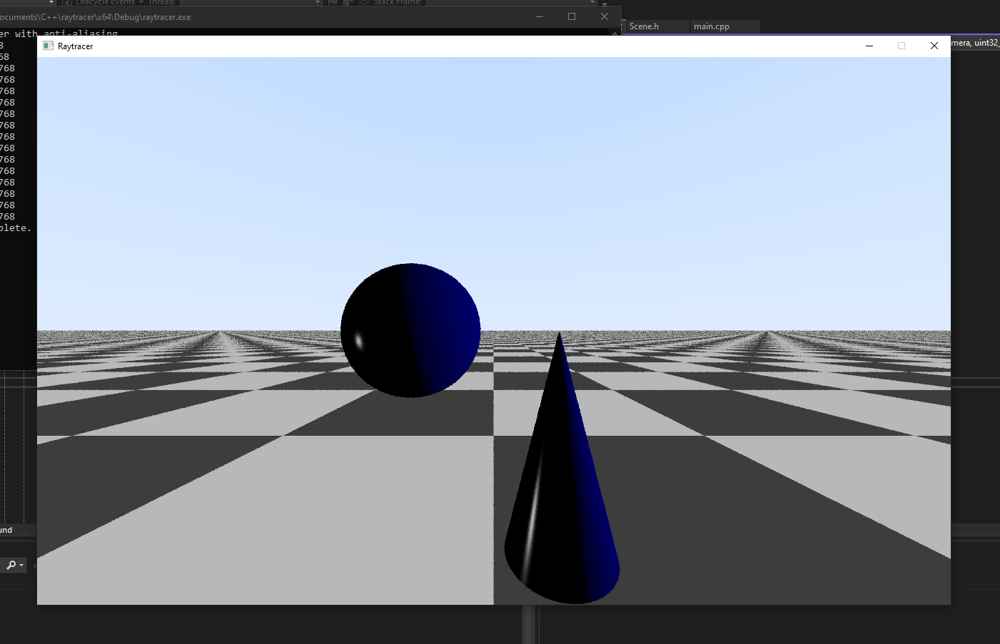

# raytracer

Raytracer built in C++

Requires SDL2.26.5

Makefile has been provided, once sdl2 is installed simply run thecommand 'make' and it will compile and generate a binary.

./raytracer to run the program once compiled.

=)

